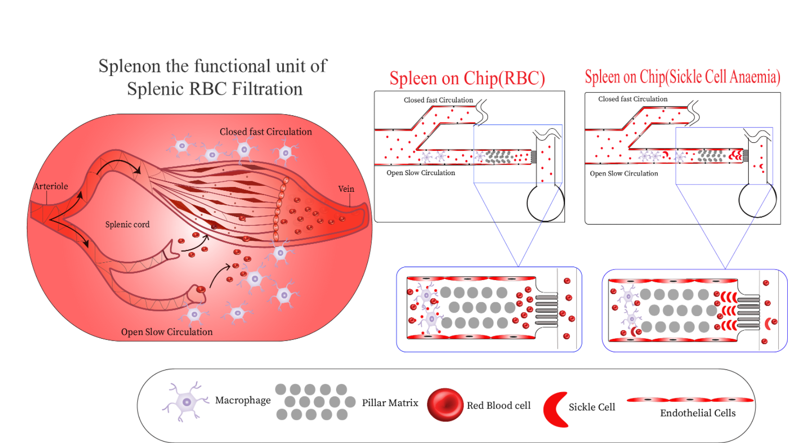
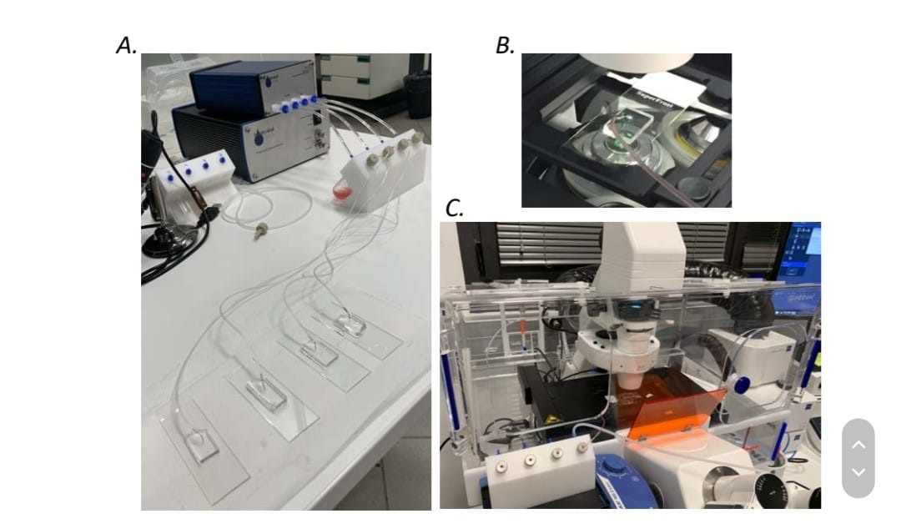
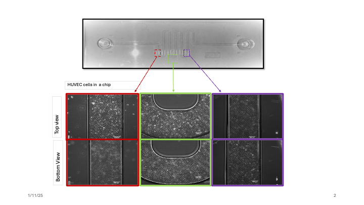
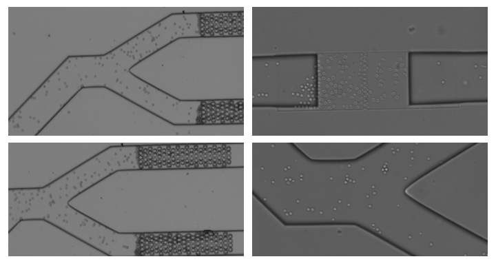
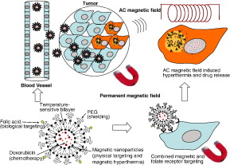

# portfolio

# Aishwarya Mellalakari

# Scientist-Biomedical Engineer

## SKILLS
- Microfabrication techniques: Plasma cleaner, UV Mask aligner, Spin coater, Profilometry, Soft lithography, Backside lithography.
- Human Cell Culture: Worked with human spleen Monocytes , endothelial cells cultured them inside the Microfluidic chip and handled the patient red blood cell inside the microfluidic device.
- Nanoparticle Synthesis: Gold nanoparticles, Silver nanoparticles, Magnetic nanoparticles, Chitosan nanoparticles, Magnetic lipid nano. capsules, ZnO nanocomposites, Hydrogel.
- Instruments known / Handling : Biodrop, DLS, Z-scan technique, Scanning electron Microscope, Transmission Electron Microscope, X-RD, FTIR .
- Digital Skills: C++, Python , AUTOCAD, COMSOL, Microsoft Office package: Microsoft Word, Excel, PowerPoint, outlook, teams.

## Education
- Ph.D., Biomedicne- Biomedical engineering | University of Barcelona , Barcelona (_Sep 2025_)    		
- M.Tech., Nanotechnology( Nanomedicine)	| Amity University ( AINT)  (_Nov 2019_)	 			        		
- B.Tech., Nanotechnolgy| Amity University ( AINT) (_Nov 2018_)

## Work Experience
**Pre-doctoral researcher at the Institute for Bioengineering of Catalunya, Barcelona, Spain
Development of Splenic Chip Model for studying Rheological properties of the Red blood cells under Prof. Josep Samitier Marti.
- Designed prototypes using SolidWorks and AutoCAD, optimizing ergonomic and manufacturable device enclosures for microfluidic applications.
- Conducted iterative testing protocols, including mechanical, thermal, and environmental testing, ensuring compliance with ISO 13485 standards.
- Collaborated with cross-functional teams of engineers and biomedical scientists, aligning system design with overall project objectives.
- Delivered technical documentation, including specifications, test results, and research findings for internal and external stakeholders.

**Visiting Researcher at Sanquin Research(Blood bank and Research center) Amsterdam , Netherlands 
- Implemented novel protocols for the isolation and differentiation of Monocytes within the Microfluidic Device, resulting in a 40% increase in cell viability compared to traditional methods to understand the interaction and behavior of the Red blood cells with Monocytes. 

**Master thesis Student at Indian Institute of Technology, Hyderabad 
- Developed magnetic lipid nanocapsules for hyperthermia applications, targeting cancer cells, and preserving healthy tissue.
- Prepared magnetic nanoparticles and tested efficacy in hyperthermia techniques for cancer treatment.
- Conducted experiments to optimize the formulation and enhance the targeting capabilities of the nanocapsules.
- Analyzed experimental data to evaluate the effectiveness of magnetic nanoparticles in selective cancer cell removal.

## Projects
### Development of the Splenice chip model for studying the mechanical properties of Red blood cells 

## Spleen-on-Chip Project

In my PhD, I developed a Spleen-on-Chip model to study the mechanical properties of red blood cells (RBCs). This innovative microfluidic device mimics the spleen's microenvironment, enabling precise analysis of RBC deformability under both normoxic and hypoxic conditions. The project involved advanced techniques such as microfabrication, cell culture, and finite element analysis (FEA) to design and validate the device. This model has potential applications in understanding blood disorders and developing targeted therapies. My work culminated in significant insights into RBC behavior, contributing to the advancement of organ-on-chip technology.

### Device Optimization Using COMSOL Simulations

Utilized COMSOL Multiphysics to simulate and optimize the microfluidic device design. These simulations were crucial in understanding fluid dynamics, shear stresses, and particle behavior within the chip. By leveraging COMSOL, I refined the design parameters to ensure accurate replication of the spleen's microenvironment, enhancing the device's performance and reliability for studying red blood cell mechanics and interactions. This process demonstrated my expertise in computational modeling and its application to microfluidic device development.

### Microfabrication Techniques
![image] (asset/PDMS Microfluidic Chip Fabrication copy.png).

Advanced microfabrication techniques to create precise and functional microfluidic devices. I utilized photolithography and backside lithography to design and fabricate intricate microchannel structures that mimic the spleen's microenvironment. These techniques allowed for high-resolution patterning and ensured the scalability of the device. Additionally, soft lithography using PDMS (polydimethylsiloxane) was employed to construct the chip, offering flexibility and biocompatibility essential for cellular studies. My proficiency in microfabrication ensured the development of a robust platform for studying red blood cell mechanics.

## Cell Culture in Microfluidic Devices

As part of my research, I optimized and performed cell culture inside microfluidic devices to replicate physiological conditions. This process involved the isolation and introduction of red blood cells (RBCs) and monocytes into precisely fabricated microchannels. Using controlled flow rates and media, I maintained viable cell cultures under dynamic conditions, enabling the study of cell behavior, interactions, and mechanical properties within the device. The microfluidic platform ensured a high degree of control over environmental parameters, facilitating detailed analyses of cell function and response in both normoxic and hypoxic conditions.

[Gif](asset/Amira_AishuÇ_0.1ul_20pª_1000fps_C001S0012.gif)

## Cell Culture of Macrophages and Endothelial Cells in Microfluidic Devices

,       

In my research, I successfully cultured macrophages and endothelial cells inside microfluidic devices to replicate tissue-specific microenvironments. These cultures required precise control of flow conditions, media composition, and environmental parameters to ensure cell viability and functionality. The platform facilitated the study of macrophage-endothelial interactions and their response to varying physiological conditions. This work highlighted the potential of microfluidic systems for studying complex cell behaviors and their applications in tissue engineering and disease modeling.

## Magnetic Thermosensitive Liposomes for Targeted Drug Delivery

In this project, I worked on developing temperature-sensitive magnetic liposomes for targeted drug delivery in cancer treatment. These liposomes were engineered to encapsulate chemotherapeutic agents and magnetic nanoparticles, enabling drug release upon exposure to hyperthermia induced by an alternating magnetic field. The system utilized folate receptor targeting for enhanced tumor cell uptake and demonstrated significant efficacy in in vitro cytotoxicity studies. My contributions included optimizing liposome composition, characterizing their thermosensitivity, and evaluating their targeting efficiency and therapeutic potential, showcasing the integration of nanotechnology and biotechnology for advanced cancer therapy​.

 
## Solar Photocatalysis for Water Purification

I contributed to developing rGO-PANI-assisted c-ZnO heterojunction nanocomposites for solar light-activated photocatalytic degradation of pharmaceutical pollutants and dyes. My work involved the synthesis of advanced nanocomposites and their characterization using techniques such as XRD, FE-SEM, and UV-Vis spectroscopy. The research demonstrated the potential of these nanocomposites to efficiently degrade antibiotics like amoxicillin and dyes under natural sunlight, providing a sustainable approach to industrial effluent treatment and water purification.
 [publication](https://github.com/Amellalakari/portfolio/blob/4010c76d975134ca04ecea3658a8864436398373/asset/1-s2.0-S0272884221008956-main.pdf)

## Courses and certifications 
- CFD Simulations in COMSOL Multiphysics [certificate](https://github.com/Amellalakari/portfolio/blob/d68f1b1920c32e46c56d01ea71ccfcc6f80a52eb/asset/CFD%20Simulations%20in%20COMSOL%20Multiphysiscs.pdf )
- Quantitative Light Microscopy at Centre for Genomic Regulation (CRG), Barcelona  [certificate](https://github.com/Amellalakari/portfolio/blob/4010c76d975134ca04ecea3658a8864436398373/asset/CRG_certificate.pdf)
-Exploringentrprenureship [certificate](https://github.com/Amellalakari/portfolio/blob/4010c76d975134ca04ecea3658a8864436398373/asset/Exploring%20entrprenureship_cert.pdf)
-	To process to establish a spin-off/start-up at IBEC
-	Basic notions to understand and deal with Venture Capital companies 
-	Researcher - Industry: modes of partnership 
-	Powerful Presentations Workshop for Scientists 
-	How to reach the industry

## Publications
1. Mellalakari, Aishwarya. (2024). Chapter Title: Spleen on a Chip. In Atala, A. & Zhang, , Body-on-a-Chip: Essentials and Applications. Elsevier ( under Review)
2. Edugulla, Girija & Aishwarya, Mellalakari & Khan, Anas & Kumar, A.B.V & Yu, Jae. (2021). Efficient solar light photocatalytic degradation of commercial pharmaceutical drug and dye using rGO-PANI assisted c-ZnO heterojunction nanocomposites.CeramicsInternational.47.10.1016/j.ceramint.2021.03.206.
3. Kumar, A.B.V & Saila, Edugulla & Narang, Prachi & Aishwarya, Mallelakari & Gautam, Meenakshi & Edugulla, Girija.(2018). Biofunctionalization and biological synthesis of the nanoparticles: Communicatio,10.1016/j.inoche.2018.12.014.  
